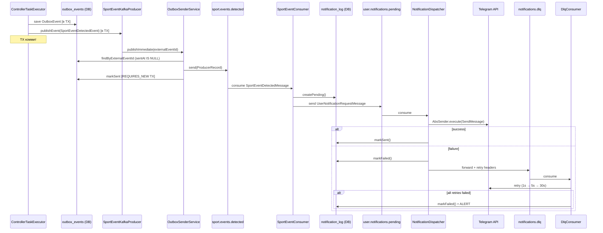
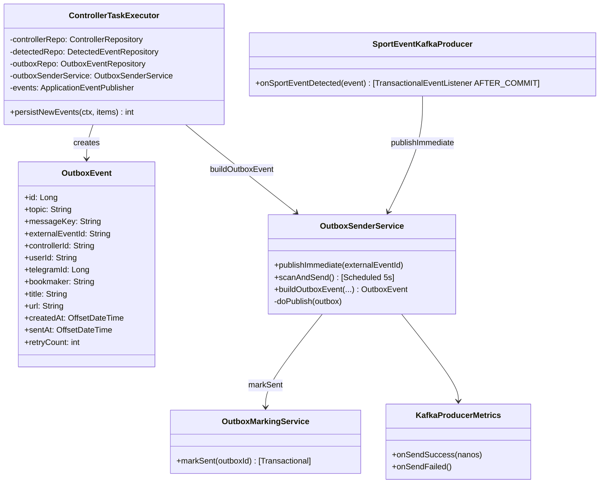
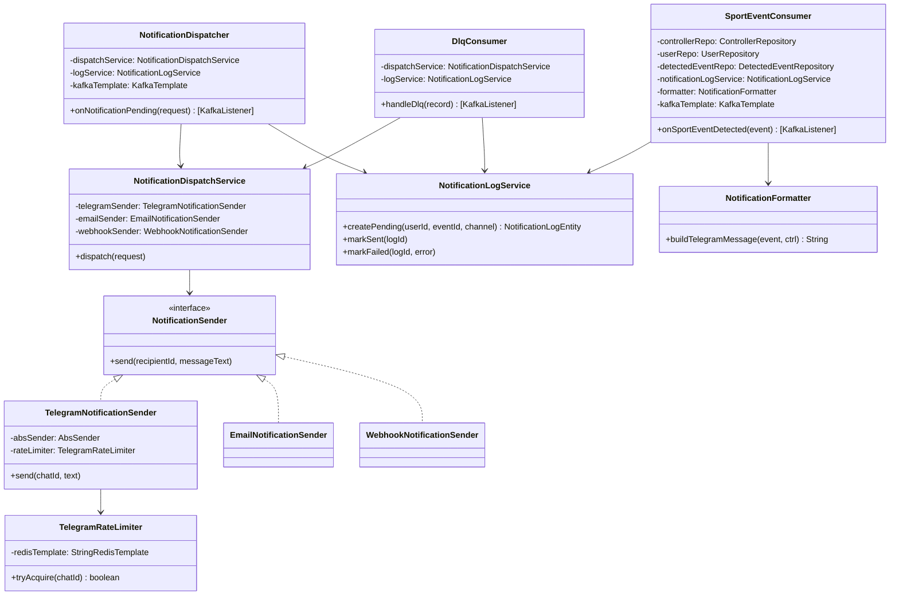
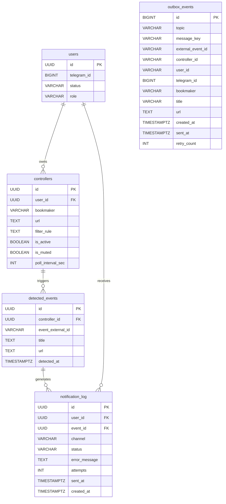

# Valui v2 — Developer Architecture Guide

> Актуально для ветки `main`. Обновляй при изменении ключевых компонентов.

---

## Содержание

1. [Обзор системы](#1-обзор-системы)
2. [Модульная структура](#2-модульная-структура)
3. [Жизненный цикл события](#3-жизненный-цикл-события)
4. [Планировщик мониторинга (valui-monitor)](#4-планировщик-мониторинга-valui-monitor)
   - 4.1 [MonitorScheduler](#41-monitorscheduler)
   - 4.2 [ControllerTask](#42-controllertask)
   - 4.3 [ControllerTaskExecutor](#43-controllertaskexecutor)
   - 4.4 [Метрики](#44-метрики)
5. [Дедупликация событий](#5-дедупликация-событий)
6. [Kafka-инфраструктура](#6-kafka-инфраструктура)
   - 6.1 [Топики](#61-топики)
   - 6.2 [Продюсер (valui-monitor)](#62-продюсер-valui-monitor)
   - 6.3 [Transactional Outbox Pattern](#63-transactional-outbox-pattern)
7. [Пайплайн уведомлений (valui-notify)](#7-пайплайн-уведомлений-valui-notify)
   - 7.1 [SportEventConsumer](#71-sporteventconsumer)
   - 7.2 [NotificationDispatcher](#72-notificationdispatcher)
   - 7.3 [TelegramNotificationSender + Rate Limiting](#73-telegramnotificationsender--rate-limiting)
   - 7.4 [DLQ Consumer](#74-dlq-consumer)
8. [Схемы классов](#8-схемы-классов)
9. [Парсеры букмекеров (valui-parser)](#9-парсеры-букмекеров-valui-parser)
10. [HTTP-клиенты и прокси](#10-http-клиенты-и-прокси)
11. [Конфигурация (application.yml)](#11-конфигурация-applicationyml)
12. [Технологический стек](#12-технологический-стек)

---

## 1. Обзор системы

Valui — Telegram-бот, который мониторит линии букмекерских контор и уведомляет
пользователей о появлении новых матчей или турниров по заданным URL.

**Принцип работы в одном предложении:**  
Каждый *controller* — это сохранённый пользователем URL букмекера; планировщик
регулярно опрашивает этот URL через парсер, сравнивает результат с тем, что уже
было видено (дедупликация), сохраняет outbox-строку в той же транзакции и публикует
события в Kafka → `SportEventConsumer` фильтрует, форматирует и отправляет
уведомление через Telegram.

---

## 2. Модульная структура

```
valui-app       ← Fat JAR, точка входа Spring Boot (@SpringBootApplication)
valui-common    ← Shared DTOs, Kafka-записи, enum BookmakerType (без Spring)
valui-bot       ← Telegram-бот, FSM состояний, inline-клавиатуры
valui-user      ← Пользователи, подписки, JPA-репозитории, Flyway
valui-parser    ← Парсеры HTTP/WebSocket для всех букмекеров
valui-monitor   ← Планировщик + дедупликация + outbox + публикация Kafka
valui-notify    ← Kafka-consumer, фильтрация, отправка уведомлений
valui-admin     ← REST API для административных операций
```

**Граф зависимостей (упрощённо):**

```
app ─────────────────────────────────────────────────────┐
 │                                                        │
 ├── monitor ──── parser ──── common                     │
 │        │                                               │
 ├── notify ──── bot ──── user ──── common                │
 │                                                        │
 └── admin ─────────────────────────────────────────────-┘
```

Зависимости текут в одну сторону. `valui-parser` не зависит от `valui-user`.
`valui-common` не имеет Spring-зависимостей — только Jakarta/Java SE.

---

## 3. Жизненный цикл события

```
Пользователь в Telegram добавляет URL
          │
          ▼
  valui-bot → Controller сохранён в PostgreSQL
  (bookmaker, url, pollIntervalSec, userId, isActive=true)
          │
          ▼ ApplicationEvent: ControllerAddedEvent
  MonitorScheduler.scheduleController()
  ├── dedup.seedIfAbsent()   ← заполняет Redis из DB (идемпотентно)
  └── triggerPool.scheduleWithFixedDelay(task, 0, pollInterval, SECONDS)
          │
          ▼ каждые pollIntervalSec секунд
  ControllerTask.run() на Virtual Thread
  ├── TX-1 (readOnly): loadContext() — свежий контекст из DB
  ├── fetch() — внешний HTTP/WS (вне транзакции!)
  └── TX-2: persistNewEvents()
       ├── dedup.claimIfNew()         ← Redis SADD (атомарно)
       ├── DetectedEventRepository.save()
       ├── OutboxEventRepository.save()  ← NEW: outbox в той же TX
       └── ApplicationEventPublisher.publishEvent(SportEventDetectedEvent)
          │
          ▼ после коммита TX-2
  SportEventKafkaProducer (@TransactionalEventListener AFTER_COMMIT)
  └── OutboxSenderService.publishImmediate(externalEventId)
       └── KafkaTemplate.send("sport.events.detected")  ← at-least-once
          │
          ▼ OutboxSenderService @Scheduled(5s) — retry несвязанных строк
  Kafka: topic "sport.events.detected" (12 partitions)
          │
          ▼
  valui-notify: SportEventConsumer
  ├── loadController() + loadUser() из DB
  ├── Проверить: isActive, !isMuted, user.status==ACTIVE
  ├── Применить filterRule (regex)
  ├── NotificationLogService.createPending() ← запись в notification_log
  ├── NotificationFormatter.buildTelegramMessage()
  └── KafkaTemplate.send("user.notifications.pending")
          │
          ▼
  valui-notify: NotificationDispatcher
  └── TelegramNotificationSender
       ├── TelegramRateLimiter (Redis 1msg/s per chatId)
       └── AbsSender.execute(SendMessage) → Telegram API
          │
          ▼ при ошибке
  Kafka: topic "notifications.dlq"
          │
          ▼
  DlqConsumer: 3 retry (1s → 5s → 30s backoff)
  └── после 3 неудач: notification_log.status = FAILED + ALERT
```

**Почему HTTP-вызов вне транзакции?**  
Держать транзакцию открытой на время сетевого запроса (сотни мс) означает
удерживать соединение из пула HikariCP. При 50 параллельных задачах — исчерпание
пула. Поэтому: TX-1 (загрузка контекста) → закрыть → HTTP → TX-2 (запись).

**Почему outbox, а не прямой KafkaTemplate внутри TX?**  
Прямой вызов `kafkaTemplate.send()` внутри транзакции не гарантирует at-least-once:
если TX закоммитилась, а Kafka-send упал — сообщение потеряно. Outbox сохраняется
атомарно с бизнес-данными; `@Scheduled`-sender гарантирует повторную доставку.

---

## 4. Планировщик мониторинга (valui-monitor)

### 4.1 MonitorScheduler

**Файл:** `valui-monitor/.../scheduler/MonitorScheduler.java`

Центральный компонент. Управляет жизненным циклом всех контроллеров.

**Два пула потоков:**

| Пул | Тип | Размер | Назначение |
|-----|-----|--------|-----------|
| `triggerPool` | Platform threads | `CPU/2`, мин. 2 | Только fires `scheduleWithFixedDelay` |
| `taskPool` | **Virtual threads** | Без ограничений | Тело задачи (HTTP + DB) |

**Почему разделение triggerPool / taskPool?**  
`ScheduledExecutorService` не поддерживает Virtual Threads напрямую. Само тело
задачи — Virtual Thread, что позволяет сотням задач блокировать I/O без overhead.

**Защита от перегрузки:**
- `globalSemaphore(50)` — жёсткий cap на всю систему
- `perUserCounter(5)` — cap на одного пользователя
- Если семафор не захвачен → итерация тихо пропускается

**Реакция на события Spring:**
```
ControllerAddedEvent      → scheduleController()
ControllerRemovedEvent    → unscheduleController()
SubscriptionChangedEvent  → rescheduleUser()
```

---

### 4.2 ControllerTask

Реализует `Runnable`. Не Spring-бин — создаётся `MonitorScheduler` на каждый контроллер.

```
run()
 ├── tryAcquire(globalSemaphore)
 ├── userSlots.incrementAndGet()
 ├── executeTask()
 │    ├── loadContext(controllerId)  — TX-1 readOnly
 │    ├── fetch(ctx)                 — HTTP/WS без TX
 │    └── persistNewEvents(ctx)      — TX-2 write
 └── release(globalSemaphore)
```

---

### 4.3 ControllerTaskExecutor

Spring-сервис с транзакционными методами.

| Метод | TX | Что делает |
|-------|-----|-----------|
| `loadAllActiveForScheduling()` | readOnly | Все активные контроллеры при старте |
| `loadContext(id)` | readOnly | Контекст + парсинг URL |
| `fetch(ctx)` | нет | HTTP/WS запрос к парсеру |
| `persistNewEvents(ctx, items)` | write | Dedup → save DetectedEvent → **save OutboxEvent** → publish SpringEvent |

**`persistNewEvents` — детали:**
1. `dedup.claimIfNew()` → Redis SADD (O(1), атомарно)
2. `DetectedEventRepository.save(entity)` — бизнес-данные
3. `OutboxEventRepository.save(outbox)` — outbox в **той же TX**
4. `ApplicationEventPublisher.publishEvent(SportEventDetectedEvent)` — Spring-событие
5. `@TransactionalEventListener(AFTER_COMMIT)` срабатывает после коммита →  
   `OutboxSenderService.publishImmediate()` → Kafka

---

### 4.4 Метрики

| Метрика | Тип | Описание |
|---------|-----|---------|
| `monitor.controllers.scheduled` | Gauge | Активных контроллеров |
| `monitor.events.detected` | Counter | Всего новых событий |
| `monitor.tasks.skipped` | Counter | Пропущено из-за лимитов |
| `monitor.task.duration` | Timer | Время задачи p50/p95/p99 |
| `cache.dedup.hit/miss` | Counter | Redis dedup статистика |
| `kafka.producer.sport_events.sent` | Counter | Kafka отправлено успешно |
| `kafka.producer.sport_events.failed` | Counter | Kafka ошибки |
| `kafka.producer.sport_events.latency` | Timer | Время от send до ack |

---

## 5. Дедупликация событий

**Redis SET** (`SADD` / `SISMEMBER`) — быстрый first-check O(1) без DB.

```
Ключ: "dedup:ctrl:{controllerId}"
Тип:  Redis SET
TTL:  7 дней
```

`claimIfNew(controllerId, eventId)` — атомарный SADD: возвращает `true` только
для новых eventId. Исключает TOCTOU-гонку.

**Двухуровневая схема надёжности:**
- Redis — быстрый claim
- PostgreSQL — источник истины
- `DedupSyncScheduler` (03:00 ежедневно) — синхронизация Redis ↔ DB

**Граничный случай — TTL истёк без рестарта:**  
Все события кажутся "новыми" → пытаются INSERT → `DataIntegrityViolationException`
→ перехватывается, логируется. `publishEvent` не вызывается, дубля нет.

---

## 6. Kafka-инфраструктура

### 6.1 Топики

Все топики создаются `KafkaTopicsConfig` через `KafkaAdmin` (idempotent, на старте).

| Топик | Partitions | Replication | Retention | Политика |
|-------|-----------|-------------|-----------|---------|
| `sport.events.detected` | 12 | 1 (local) / 3 (prod) | 7 дней | DELETE |
| `user.notifications.pending` | 6 | 1 / 3 | 3 дня | DELETE |
| `subscription.events` | 4 | 1 / 3 | compacted | COMPACT |
| `audit.log` | 6 | 1 / 3 | 30 дней | DELETE |
| `notifications.dlq` | 3 | 1 / 3 | 14 дней | DELETE |

**Ключи партиционирования:**
- `sport.events.detected` → key = `controllerId` — все события одного контроллера в одну партицию
- `user.notifications.pending` → key = `userId` — упорядоченность для одного пользователя

### 6.2 Продюсер (valui-monitor)

**Гарантии надёжности** (`KafkaProducerConfig`):

```yaml
acks: all              # ждать подтверждения от всех in-sync replicas
retries: 3             # автоматические повторы
enable-idempotence: true  # exactly-once на уровне брокера
max-in-flight: 5       # макс. в полёте (лимит при idempotence)
linger-ms: 5           # небольшой батчинг для снижения нагрузки
```

**Type headers:** `ADD_TYPE_INFO_HEADERS=true` — продюсер добавляет `__TypeId__`
в заголовок; консьюмер с `USE_TYPE_INFO_HEADERS=true` автоматически десериализует
в нужный Java-тип без явного конфига.

### 6.3 Transactional Outbox Pattern

**Проблема:** прямой `kafkaTemplate.send()` после коммита TX — не atomic.
Crash между коммитом DB и отправкой в Kafka = потеря сообщения.

**Решение (Outbox):**

```
persistNewEvents() [в TX]
 ├── DetectedEventEntity → detected_events
 └── OutboxEvent → outbox_events (topic, messageKey, eventData, sentAt=null)
     ↓ TX коммит
SportEventKafkaProducer [@TransactionalEventListener(AFTER_COMMIT)]
 └── OutboxSenderService.publishImmediate(externalEventId)
      ├── найти outbox по externalEventId, где sentAt IS NULL
      ├── KafkaTemplate.send(ProducerRecord с headers: source, version)
      └── на успех: OutboxMarkingService.markSent(outbox.id)  [REQUIRES_NEW TX]
          ↓ при падении Kafka или краше приложения
OutboxSenderService [@Scheduled(5000)]
 └── найти unsent outbox WHERE createdAt < now()-15s
      └── повторить publish + markSent
```

**Таблица `outbox_events`** (Flyway V8):

| Колонка | Тип | Описание |
|---------|-----|---------|
| `id` | BIGSERIAL | PK |
| `topic` | VARCHAR(64) | Kafka топик |
| `message_key` | VARCHAR(36) | controllerId (ключ партиции) |
| `external_event_id` | VARCHAR(255) | UNIQUE — внешний ID от букмекера |
| `controller_id` / `user_id` | VARCHAR(36) | Денормализованные данные для повтора |
| `telegram_id` | BIGINT | nullable |
| `bookmaker` / `title` / `url` | VARCHAR/TEXT | Данные события |
| `created_at` | TIMESTAMPTZ | Время создания |
| `sent_at` | TIMESTAMPTZ | null = не отправлено |
| `retry_count` | INT | Число попыток |

**Partial index:** `WHERE sent_at IS NULL` — сканирует только необработанные строки.

---

## 7. Пайплайн уведомлений (valui-notify)

### 7.1 SportEventConsumer

**Группа:** `valui-notify-group` | **Топик:** `sport.events.detected` | **Concurrency:** 3

Фильтры (порядок важен, первый false = drop):

1. `controller.isActive == true`
2. `controller.isMuted == false`
3. `user.status == ACTIVE`
4. `filterRule` regex совпадает с `event.title` (если правило задано)

При прохождении всех фильтров:
- `NotificationLogEntity` (status=PENDING) → `notification_log`
- `NotificationFormatter.buildTelegramMessage()` → Markdown ≤4096 символов
- Publish → `user.notifications.pending` с `notificationLogId` в теле

**Важно:** controller и user загружаются через отдельные `findById()` запросы
(не через lazy-загрузку `controller.getUser()`), чтобы избежать `LazyInitializationException`
вне транзакции.

**filterRule:** применяется как `Pattern.compile(rule, CASE_INSENSITIVE).matcher(title).find()`.
При невалидном regex — логируем warning, пропускаем фильтр (событие проходит).

### 7.2 NotificationDispatcher

**Группа:** `valui-notify-dispatch-group` | **Топик:** `user.notifications.pending` | **Concurrency:** 2

Маршрутизирует по `channel`:

```java
switch (NotificationChannel.valueOf(request.channel())) {
    case TELEGRAM → TelegramNotificationSender
    case EMAIL    → EmailNotificationSender (stub)
    case WEBHOOK  → WebhookNotificationSender (stub)
}
```

На успех: `notification_log.status = SENT`, `sent_at = now()`  
На ошибку: `status = FAILED` + forward в `notifications.dlq`

### 7.3 TelegramNotificationSender + Rate Limiting

**Rate limiter** (`TelegramRateLimiter`) — Redis INCR+TTL, 1 msg/s per chatId:

```
key = "rate:tg:{chatId}"
INCR key  → count
if count == 1: EXPIRE key 1s
allow = (count <= 1)
```

При превышении — sleep 1.2s + повторная попытка. При двукратном отказе — `RuntimeException`
→ сообщение в DLQ.

**429 от Telegram:** `TelegramApiRequestException.getErrorCode() == 429` →
sleep `MAX_RATE_WAIT_MS` (2s) → одна повторная попытка.

**Вызов:** `absSender.execute(SendMessage)` напрямую (не через `MessageSend.textMarkdown`),
чтобы исключения 429 не были проглочены.

### 7.4 DLQ Consumer

**Группа:** `valui-dlq-group` | **Топик:** `notifications.dlq` | **Concurrency:** 1

Стратегия: 3 попытки с backoff **перед** каждой:

| Попытка | Задержка перед |
|---------|---------------|
| 1 | 1 с |
| 2 | 5 с |
| 3 | 30 с |

После 3 неудач: `notification_log.status = FAILED` + `log.error("ALERT: ...")`.

**Concurrency=1:** DLQ низкочастотный, единственный поток предотвращает
параллельное переотправление одному пользователю.

**Типизация:** DLQ может принять и `SportEventDetectedMessage` (из consumer sports),
и `UserNotificationRequestMessage` (из dispatcher). Обрабатывается через `instanceof`
pattern matching; неизвестные типы логируются и пропускаются.

---

## 8. Схемы классов

### 8.1 Зависимости модулей


### 8.2 Kafka — поток событий



### 8.3 Классы valui-monitor (Outbox)



### 8.4 Классы valui-notify (Notification Pipeline)



### 8.5 Схема базы данных (ключевые таблицы)



---

## 9. Парсеры букмекеров (valui-parser)

Все парсеры реализуют `BookmakerParser`:

```java
ParseResult<List<SportDto>>      fetchSports()
ParseResult<List<TournamentDto>> fetchTournaments(String sportId)
ParseResult<List<MatchDto>>      fetchMatches(String tournamentId)
```

Оборачиваются в `@CircuitBreaker` + `@Retry` через Resilience4j.

### Сводная таблица

| | Fonbet | 1xBet | Olimp | BetCity | BetBoom |
|---|---|---|---|---|---|
| **Протокол** | HTTPS | HTTPS + HTTP CONNECT | HTTPS | HTTPS | WSS |
| **Формат** | JSON | JSON gzip | JSON | JSON | Protobuf |
| **Прокси** | нет | HTTP 4232 | нет | нет | нет |
| **HTTP-клиент** | Reactor Netty | JDK HttpClient | Reactor Netty | Reactor Netty | — |
| **Кэш** | 30с in-memory | Redis 1м | нет | нет | нет |
| **CB окно** | 10 | 10 | 10 | 10 | 6 |
| **CB открыт** | 30с | 30с | 30с | 30с | **60с** |
| **Retry** | 2 | 2 | 2 | 2 | **нет** |

**Fonbet:** пул из 200 CDN-зеркал в Redis ZSet (score = timestamp последнего успеха).
Bootstrap при старте — 8 параллельных HEAD-запросов.

**1xBet:** JDK HttpClient (не WebFlux) — формирует правильный JA3-fingerprint.
`jdk.http.auth.tunneling.disabledSchemes=""` для Basic-auth через HTTP CONNECT.

**BetBoom:** WSS + бинарный Protobuf. Пул WS-соединений (min=2, max=6).
`WsRequestService` с jitter 0–200ms для anti-flood.

---

## 10. HTTP-клиенты и прокси

| Бин | Класс | Прокси | Для кого |
|-----|-------|--------|---------|
| `xbetHttpClient` | `SocksBookmakerHttpClient` | HTTP CONNECT :4232 | XBet |
| `fonbetHttpClient` | `BookmakerHttpClient` | нет | Fonbet |
| `olimpHttpClient` | `BookmakerHttpClient` | нет | Olimp |
| `betcityHttpClient` | `BookmakerHttpClient` | нет | BetCity |

**`BookmakerHttpClient` (Reactor Netty):**
- HTTP/1.1, gzip, Connect: 8с, Response: 15с, Max buffer: 10 MB

**`SocksBookmakerHttpClient` (JDK 21):**
- JA3-safe TLS, HTTP CONNECT proxy, ручная gzip-декомпрессия

**Telegram proxy** — отдельная конфигурация `valui.bot.proxy` (SOCKS5 :14232),
**не связана** с `parser.proxy` (HTTP :4232).

---

## 11. Конфигурация (application.yml)

Профили: `local` | `docker` | `prod`

### Мониторинг

```yaml
valui:
  monitor:
    max-concurrent-tasks: 50
    max-tasks-per-user: 5
    default-poll-interval-sec: 60
    dedup-ttl-days: 7
    dedup-sync-cron: "0 0 3 * * *"
    outbox:
      scan-interval-ms: 5000   # частота @Scheduled retry outbox
```

### Kafka

```yaml
spring:
  kafka:
    bootstrap-servers: localhost:9092
    consumer:
      auto-offset-reset: earliest
      group-id: valui-notify-group
    producer:
      acks: all

kafka:
  topics:
    replication-factor: 1   # local/docker; 3 для prod
  schema-registry:
    url: ""                  # оставить пустым если нет Schema Registry
```

### Парсеры

```yaml
parser:
  proxy:
    enabled: true
    host: 91.147.122.69
    port: 4232
    username: user283146
    password: 0w3qzb
  cache:
    sports-ttl: 1h
    tournaments-ttl: 30m
    matches-ttl: 5m
```

### Resilience4j

```yaml
resilience4j:
  circuitbreaker:
    configs:
      parser-default:
        failure-rate-threshold: 50
        wait-duration-in-open-state: 30s
        sliding-window-size: 10
    instances:
      betboom-cb:
        wait-duration-in-open-state: 60s
        sliding-window-size: 6
```

---

## 12. Технологический стек

| Категория | Технология | Версия |
|-----------|-----------|--------|
| Язык | Java | 21 (Virtual Threads) |
| Фреймворк | Spring Boot | 3.3.5 |
| Сборка | Maven | 3.9+ |
| БД | PostgreSQL | 15+ |
| Миграции | Flyway | — |
| Кэш / Dedup | Redis (Lettuce) | — |
| Брокер | Apache Kafka | 3.x |
| HTTP (реактивный) | Reactor Netty / WebFlux | — |
| HTTP (JA3-safe) | JDK 21 `java.net.http.HttpClient` | — |
| WebSocket | Reactor Netty WS | — |
| Protobuf | Google Protobuf | — |
| Resilience | Resilience4j | — |
| Метрики | Micrometer → Prometheus | — |
| Кодогенерация | Lombok, MapStruct | — |
| Telegram | telegrambots | 6.9.7.1 |
| Тесты | JUnit 5, Mockito, Testcontainers | — |

> `_migration/` — устаревшая монолитная версия v1, оставлена как справочник.
