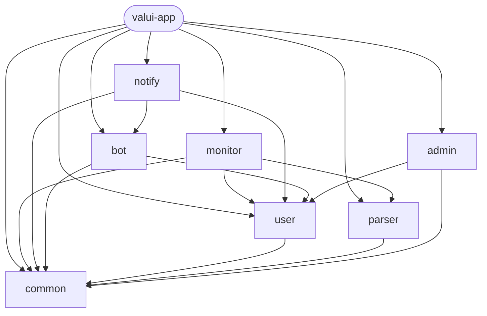
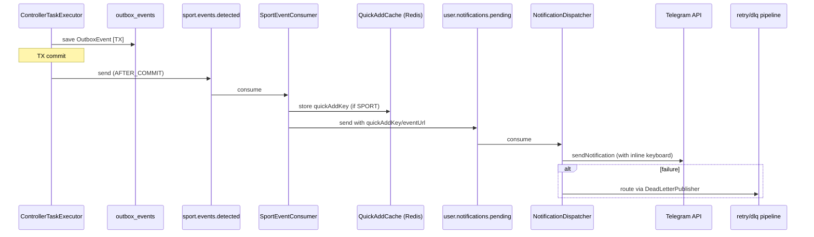
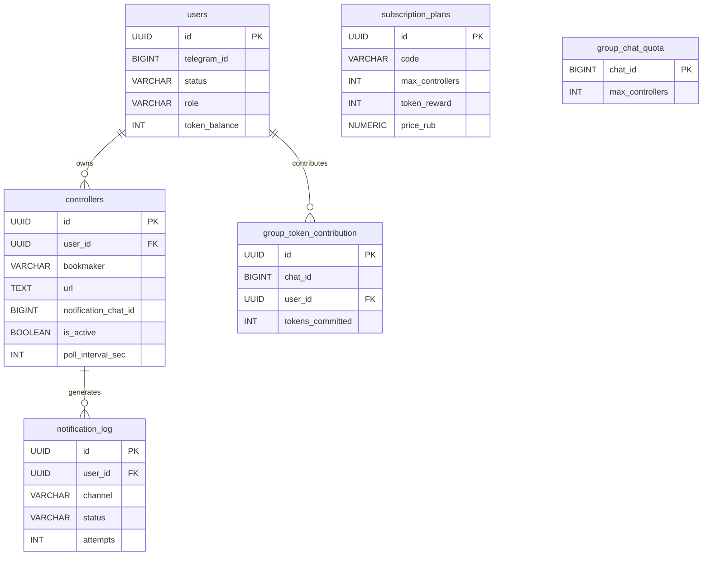

# Valui v2 — Developer Architecture Guide

> Актуально для ветки `main`. Обновляй при изменении ключевых компонентов.

---

## Содержание

1. [Обзор системы](#1-обзор-системы)
2. [Модульная структура](#2-модульная-структура)
3. [Жизненный цикл события](#3-жизненный-цикл-события)
4. [Планировщик мониторинга (valui-monitor)](#4-планировщик-мониторинга-valui-monitor)
5. [Дедупликация событий](#5-дедупликация-событий)
6. [Kafka-инфраструктура](#6-kafka-инфраструктура)
7. [Пайплайн уведомлений (valui-notify)](#7-пайплайн-уведомлений-valui-notify)
8. [Telegram-бот (valui-bot)](#8-telegram-бот-valui-bot)
9. [Групповые чаты и квоты](#9-групповые-чаты-и-квоты)
10. [Аудит и надёжность](#10-аудит-и-надёжность)
11. [Схемы классов](#11-схемы-классов)
12. [Парсеры букмекеров (valui-parser)](#12-парсеры-букмекеров-valui-parser)
13. [Конфигурация](#13-конфигурация)
14. [Технологический стек](#14-технологический-стек)

---

## 1. Обзор системы

Valui — Telegram-бот мониторинга букмекерских событий. Пользователь добавляет URL
турнира или вида спорта; планировщик регулярно опрашивает его через парсер,
сравнивает с ранее виденным (дедупликация) и отправляет уведомление через Kafka.

Поддерживаются как личные чаты, так и групповые чаты Telegram — у каждого режима
своя квота на контроллеры (см. раздел 9).

---

## 2. Модульная структура

```
valui-app       ← Fat JAR, точка входа Spring Boot (@SpringBootApplication)
valui-common    ← Shared DTOs, Kafka-записи, JPA entities, enum-ы (без Spring runtime)
valui-bot       ← Telegram-бот, FSM состояний, inline-клавиатуры
valui-user      ← Пользователи, подписки, группы, JPA-репозитории, Flyway
valui-parser    ← Парсеры HTTP/WebSocket для всех букмекеров
valui-monitor   ← Планировщик + дедупликация + outbox + публикация Kafka
valui-notify    ← Kafka-consumer, фильтрация, отправка уведомлений
valui-admin     ← REST API для административных операций
```

**Граф зависимостей:**

```
app ──▶ monitor ──▶ parser ──▶ common
app ──▶ notify  ──▶ bot    ──▶ user ──▶ common
app ──▶ admin   ──▶ user
```

`valui-common` — без Spring-зависимостей (только Jakarta/Java SE). Это принципиально:
тесты компилируются без Spring-контекста, а `common` можно переиспользовать в
других сервисах без transitive зависимостей.

---

## 3. Жизненный цикл события

```
Пользователь добавляет URL (личка или группа)
          │
          ▼
  valui-bot → ControllerServiceImpl.addController(req, fromId, notificationChatId)
  Сохраняется: bookmaker, url, userId, notificationChatId, pollIntervalSec
          │
          ▼ ApplicationEvent: ControllerAddedEvent
  MonitorScheduler.scheduleController()
  └── triggerPool.scheduleWithFixedDelay(task, 0, pollInterval, SECONDS)
          │
          ▼ каждые pollIntervalSec секунд (Virtual Thread)
  ControllerTask.run()
  ├── TX-1 (readOnly): loadContext()
  ├── fetch()          — HTTP/WS вне TX (не держим соединение!)
  └── TX-2: persistNewEvents()
       ├── dedup.claimIfNew()          ← Redis SADD
       ├── DetectedEventRepository.save()
       ├── OutboxEventRepository.save()
       └── ApplicationEventPublisher.publishEvent()
          │ после коммита TX-2
          ▼
  SportEventKafkaProducer [@TransactionalEventListener AFTER_COMMIT]
  └── OutboxSenderService → KafkaTemplate → "sport.events.detected"
          │
          ▼
  SportEventConsumer (valui-notify)
  ├── фильтры: isActive / !isMuted / ACTIVE / filterRule
  ├── QuickAddCacheService.store(notificationLogId, {url, bookmaker, title})  ← если SPORT
  ├── notification_log PENDING
  └── KafkaTemplate → "user.notifications.pending"
          │
          ▼
  NotificationDispatcher → TelegramNotificationSender
  ├── buildKeyboard(): кнопка "➕ Следить" (SPORT) или "🔗 Открыть" (MATCH/TOURNAMENT)
  ├── TelegramRateLimiter (Redis, 1 msg/s per chatId)
  └── AbsSender.execute(SendMessage) → Telegram API
          │ при ошибке
          ▼
  retry.1s → retry.5s → retry.30s → dlq → dlq.final → ALERT
```

**Почему HTTP вне транзакции?** Держать TX открытой во время сетевого запроса (сотни мс)
исчерпывает пул HikariCP при 50+ параллельных задачах.

**Почему Outbox?** Прямой `kafkaTemplate.send()` после коммита не гарантирует at-least-once:
crash между коммитом DB и Kafka-send = потеря. Outbox сохраняется атомарно с данными;
`@Scheduled` повторяет неотправленные строки.

---

## 4. Планировщик мониторинга (valui-monitor)

### MonitorScheduler

Два пула потоков:

| Пул | Тип | Назначение |
|-----|-----|-----------|
| `triggerPool` | Platform threads (CPU/2) | Только fires scheduleWithFixedDelay |
| `taskPool` | **Virtual threads** | Тело задачи (HTTP + DB) |

`ScheduledExecutorService` не поддерживает Virtual Threads напрямую — тело задачи
делегируется в `taskPool`, где блокирующий I/O не стоит ничего.

**Защита от перегрузки:**
- `globalSemaphore(50)` — жёсткий cap на всю систему
- `perUserCounter(5)` — cap на одного пользователя

**Spring-события → расписание:**
```
ControllerAddedEvent      → scheduleController()
ControllerRemovedEvent    → unscheduleController()
SubscriptionChangedEvent  → rescheduleUser()
```

### ControllerTaskExecutor

| Метод | TX | Что делает |
|-------|----|-----------|
| `loadContext(id)` | readOnly | Контекст + парсинг URL |
| `fetch(ctx)` | нет | HTTP/WS запрос к парсеру |
| `persistNewEvents(ctx, items)` | write | Dedup → DetectedEvent → OutboxEvent → SpringEvent |

### Метрики (Micrometer)

| Метрика | Тип |
|---------|-----|
| `monitor.controllers.scheduled` | Gauge |
| `monitor.events.detected` | Counter |
| `monitor.tasks.skipped` | Counter |
| `monitor.task.duration` | Timer (p50/p95/p99) |
| `cache.dedup.hit/miss` | Counter |
| `kafka.producer.sport_events.sent/failed/latency` | Counter/Timer |

---

## 5. Дедупликация событий

**Redis SET** (`dedup:ctrl:{controllerId}`, TTL 7 дней):

```
claimIfNew(controllerId, eventId) → Redis SADD
  true  → новое событие, продолжаем
  false → дубль, пропускаем
```

**Двухуровневая надёжность:**
- Redis — быстрый claim O(1)
- PostgreSQL `detected_events` — источник истины
- `DedupSyncScheduler` (03:00 ежедневно) — синхронизирует Redis ↔ DB

**Если TTL истёк:** Redis пустой → SADD вернёт true → INSERT → `DataIntegrityViolationException`
→ перехватывается, дубля нет.

---

## 6. Kafka-инфраструктура

### 6.1 Топики

| Топик | Partitions | Retention | Ключ |
|-------|-----------|-----------|------|
| `sport.events.detected` | 12 | 7 дней | controllerId |
| `user.notifications.pending` | 6 | 3 дня | userId |
| `subscription.events` | 4 | compacted | userId |
| `audit.log` | 6 | 30 дней | userId |
| `notifications.dlq` | 3 | 14 дней | — |
| `notifications.retry.1s/5s/30s` | 3 | 1 день | — |
| `notifications.dlq.final` | 3 | 30 дней | — |

### 6.2 Retry / DLQ pipeline

```
NotificationDispatcher
  └── при ошибке → DeadLetterPublisher
        ├── attempt 1 → notifications.retry.1s
        ├── attempt 2 → notifications.retry.5s
        ├── attempt 3 → notifications.retry.30s
        ├── attempt 4 → notifications.dlq (ручной просмотр)
        └── attempt 5 → notifications.dlq.final (финальный провал)

DlqMonitor (@Scheduled 15min)
  └── если dlq.final.count > 10 → ALERT в Telegram (admin chat)

Admin REST API:
  POST /api/v1/admin/dlq/replay   ← replay из dlq.final
  GET  /api/v1/admin/dlq/stats
```

### 6.3 Schema Registry

При старте `SchemaRegistrationService` (@EventListener ApplicationReadyEvent) регистрирует
4 Avro-схемы (`SportEventDetected`, `UserNotificationRequest`, `AuditEntry`,
`SubscriptionChangedEvent`) через Confluent Schema Registry REST API.

Совместимость: `BACKWARD` — новые консьюмеры читают старые сообщения.

---

## 7. Пайплайн уведомлений (valui-notify)

### SportEventConsumer

**Фильтры (порядок важен):**
1. `controller.isActive == true`
2. `controller.isMuted == false`
3. `user.status == ACTIVE`
4. `filterRule` regex совпадает с `event.title` (если задан)

При прохождении:
- Если тип SPORT: `QuickAddCacheService.store(notificationLogId, {url, bookmaker, title})`
  с TTL 30 дней → кнопка "➕ Следить за турниром" в уведомлении
- `notification_log PENDING`
- publish → `user.notifications.pending` с `quickAddKey` или `eventUrl`

### TelegramNotificationSender

Два entry point:
- `send(chatId, text)` — plain text (DLQ retry, legacy)
- `sendNotification(request)` — полное сообщение с клавиатурой:
  - SPORT → кнопка `QADD:{uuid}` (callback, открывает QuickAdd)
  - TOURNAMENT/MATCH → кнопка URL "🔗 Открыть матч"

**Rate limiter:** Redis INCR+TTL, 1 msg/s per chatId. При превышении: sleep 1.2s + retry.

---

## 8. Telegram-бот (valui-bot)

### Контекст обновления

`BotUpdateContext` содержит два разных ID:

| Поле | Значение | Использование |
|------|---------|--------------|
| `chatId` | ID чата (отрицательный = группа) | Куда слать ответ, `notificationChatId` |
| `fromId` | Личный ID пользователя (всегда положительный) | Сессия FSM, user lookup, проверка прав |

`CommandRouter` извлекает оба ID независимо. Это исправляет критический баг:
до разделения в группах сессии разных пользователей перемешивались (chatId = groupId
использовался как ключ Redis-сессии).

### FSM-сессия

Хранится в Redis (`bot:session:{fromId}`, TTL 30 мин). Ключ — `fromId` (личный ID),
поэтому у каждого пользователя своя независимая сессия даже в одной группе.

**Состояния:**
```
IDLE → SELECTING_BOOKMAKER → SELECTING_SPORT → SELECTING_TOURNAMENT
     → WAITING_FILTER_RULE → WAITING_CONFIRM_CREATE → IDLE
IDLE → WAITING_BOOST_AMOUNT → IDLE
```

### Постоянная клавиатура

`MainMenuKeyboard` формируется при `/start` и `/menu`. В группах добавляется
дополнительная кнопка "🚀 Расширить квоту группы" (BTN_BOOST).

### Callback-обработчики

| Prefix | Handler | Описание |
|--------|---------|---------|
| `QADD:` | QuickAddControllerCallback | Быстрое добавление из уведомления |
| `BOOST:` | GroupBoostCallback | Трата токенов на расширение квоты группы |
| `CTRL:` | Controller*Callback | Просмотр/управление контроллерами |
| `CCONF:` | ControllerConfirmCallback | Финальный шаг мастера добавления |

### Команда /info

Контекстно-зависимая:
- **Личка:** план + контроллеры + фильтры + баланс токенов + дата истечения
- **Группа:** квота группы + активных + кто сколько токенов внёс

---

## 9. Групповые чаты и квоты

### Модель данных

```
controllers.notification_chat_id  ← куда идут уведомления (null = личка пользователя)

users.token_balance               ← токены для расширения групповых квот

group_chat_quota
  chat_id        PK BIGINT        ← ID группы (отрицательный)
  max_controllers INT DEFAULT 3   ← потолок группы

group_token_contribution
  chat_id        BIGINT
  user_id        UUID FK → users
  tokens_committed INT             ← сколько токенов этот пользователь вложил
  UNIQUE(chat_id, user_id)
```

### Бизнес-логика квот

**Личная квота** (plan.maxControllers) и **групповая квота** (group_chat_quota.max_controllers)
независимы. При добавлении контроллера в группу оба условия должны выполняться.

**Групповая квота:** 3 бесплатных слота + Σ(tokens_committed) от всех участников.

**Токены:** выдаются при активации платного плана (FREE=0, PRO=50, PREMIUM=300, one-time).
Тратятся через кнопку "🚀 Расширить квоту" → FSM WAITING_BOOST_AMOUNT → `GroupQuotaService.contributeTokens()`.

**При истечении подписки** (`SubscriptionServiceImpl.expireSubscription`):
1. `GroupQuotaService.revokeAllContributions(userId)` — перебирает все группы пользователя
2. Для каждой группы: `max_controllers -= revoked_tokens`, нижний порог = 3
3. Если `active > new_max`: деактивируются сначала контроллеры экс-подписчика,
   затем остальные

### GroupQuotaService

| Метод | Описание |
|-------|---------|
| `hasCapacity(chatId)` | activeCount < maxControllers? |
| `checkGroupCapacity(chatId)` | throws SubscriptionLimitExceededException |
| `contributeTokens(telegramId, chatId, tokens)` | Тратит токены, расширяет квоту |
| `revokeAllContributions(userId)` | Отзывает токены при истечении подписки |
| `getGroupStatus(chatId)` | Возвращает GroupStatusDto (для /info в группе) |

---

## 10. Аудит и надёжность

### Сквозное аудит-логирование

`@Audit(action=..., entityType=...)` — аспект перехватывает методы сервисов.
Идентификация: из SecurityContext (REST) или первого `Long` аргумента (Bot).

```
AuditAspect → AuditService
  ├── KafkaTemplate → "audit.log" (fire-and-forget)
  └── при ошибке Kafka: AuditFallbackRepository → audit_fallback (PostgreSQL)

AuditLogConsumer (batch-50, AckMode.MANUAL_IMMEDIATE)
  └── AuditLogRepository.saveAll()
```

### DLQ и retry

Описано в разделе 6.2. Ключевые участники:
- `DeadLetterPublisher` — маршрутизирует по attempt count (1s → 5s → 30s → dlq → dlq.final)
- `RetryTopicConsumer` — sleep loop для каждого retry-топика
- `DlqMonitor` — @Scheduled(15min), алертит если dlq.final > threshold(10)

---

## 11. Схемы классов

### Зависимости модулей



### Kafka — поток событий



### База данных (ключевые таблицы)



---

## 12. Парсеры букмекеров (valui-parser)

Все парсеры реализуют `BookmakerParser`:
```java
ParseResult<List<SportDto>>      fetchSports()
ParseResult<List<TournamentDto>> fetchTournaments(String sportId)
ParseResult<List<MatchDto>>      fetchMatches(String tournamentId)
```

Оборачиваются в `@CircuitBreaker` + `@Retry` через Resilience4j.

| | Fonbet | 1xBet | Olimp | BetCity | BetBoom |
|---|---|---|---|---|---|
| **Протокол** | HTTPS | HTTPS+CONNECT | HTTPS | HTTPS | WSS |
| **Формат** | JSON | JSON gzip | JSON | JSON | Protobuf |
| **Прокси** | нет | HTTP :4232 | нет | нет | нет |
| **CB открыт** | 30с | 30с | 30с | 30с | 60с |

**Fonbet:** пул из 200 CDN-зеркал в Redis ZSet.  
**1xBet:** JDK HttpClient (JA3-safe fingerprint), HTTP CONNECT proxy.  
**BetBoom:** WSS + Protobuf, пул соединений (min=2, max=6).

---

## 13. Конфигурация

Профили: `local` | `docker` | `prod`

```yaml
valui:
  monitor:
    max-concurrent-tasks: 200
    max-tasks-per-user: 30
    default-poll-interval-sec: 20

spring:
  kafka:
    bootstrap-servers: localhost:9092
    producer:
      acks: all

kafka:
  topics:
    replication-factor: 1   # 3 для prod
  schema-registry:
    url: ""                  # пустой = Schema Registry отключён
```

**Flyway миграции** (`valui-app/src/main/resources/db/migration`):

| Версия | Описание |
|--------|---------|
| V1 | init schema (users, controllers, detected_events, notification_log) |
| V2 | seed plans (FREE, PRO, PREMIUM) |
| V3 | indexes |
| V4 | payment_transactions |
| V5 | free plan all bookmakers |
| V6 | fix extra_data type |
| V7 | global_filters |
| V8 | outbox_events + partial index |
| V9 | audit_fallback |
| V10 | notification_chat_id на controllers |
| V11 | token_balance на users, group_chat_quota, group_token_contribution |
| V12 | token_reward на subscription_plans |

---

## 14. Технологический стек

| Категория | Технология | Версия |
|-----------|-----------|--------|
| Язык | Java | 21 (Virtual Threads) |
| Фреймворк | Spring Boot | 3.3.5 |
| БД | PostgreSQL | 15+ |
| Миграции | Flyway | — |
| Кэш / Dedup / Сессии | Redis (Lettuce) | — |
| Брокер | Apache Kafka | 3.x |
| Schema Registry | Confluent | 7.6.x |
| HTTP (реактивный) | Reactor Netty / WebFlux | — |
| HTTP (JA3-safe) | JDK 21 `java.net.http` | — |
| Protobuf | Google Protobuf | — |
| Resilience | Resilience4j | — |
| Метрики | Micrometer → Prometheus | — |
| AOP / Аудит | Spring AOP + @Aspect | — |
| Кодогенерация | Lombok, MapStruct | — |
| Telegram | telegrambots | 6.9.7.1 |
| Тесты | JUnit 5, Mockito, Testcontainers | — |

> `_migration/` — устаревшая монолитная версия v1, оставлена как справочник.
